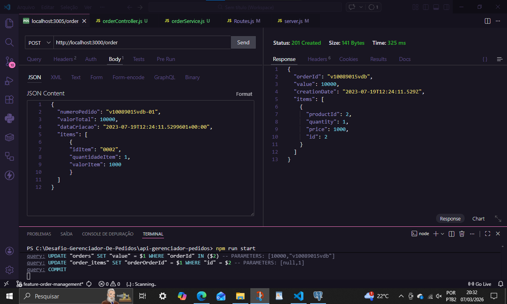
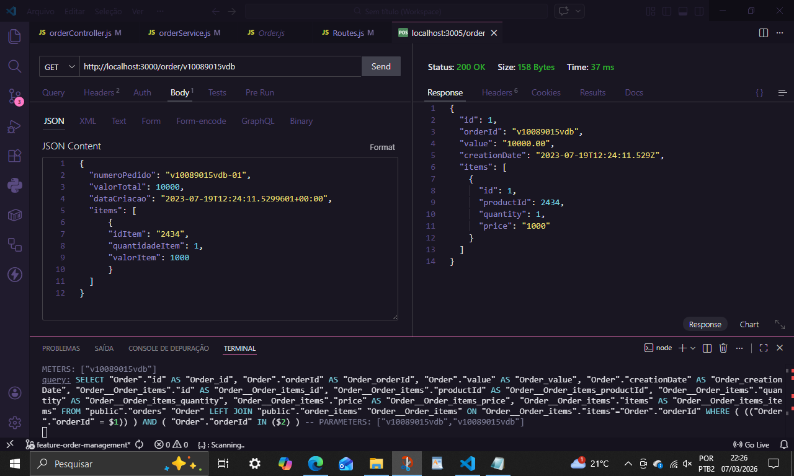
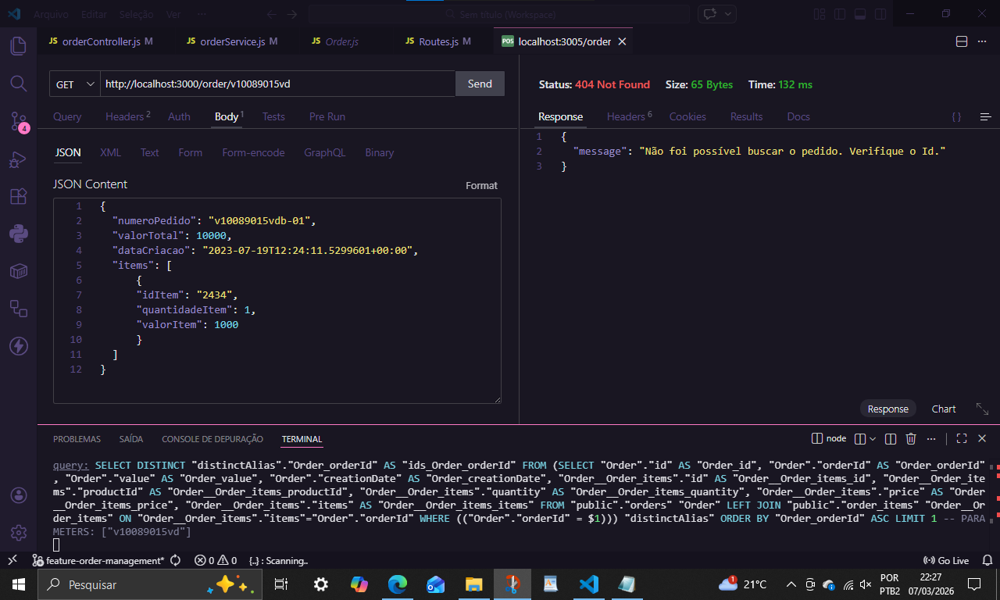
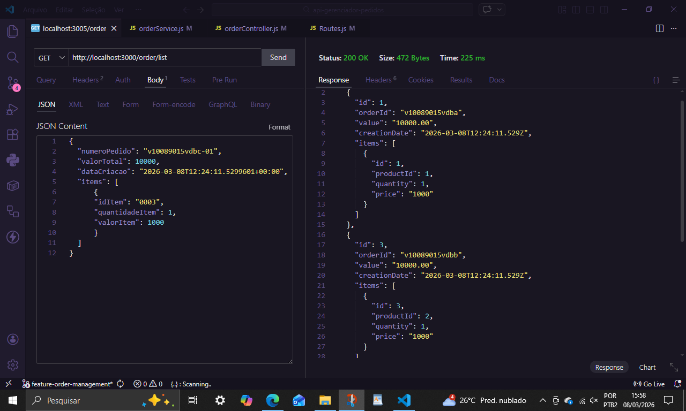
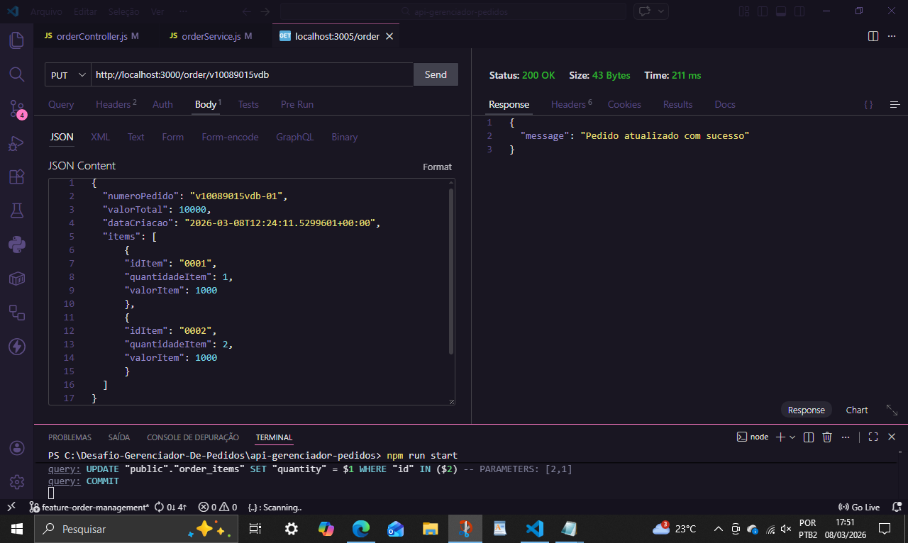
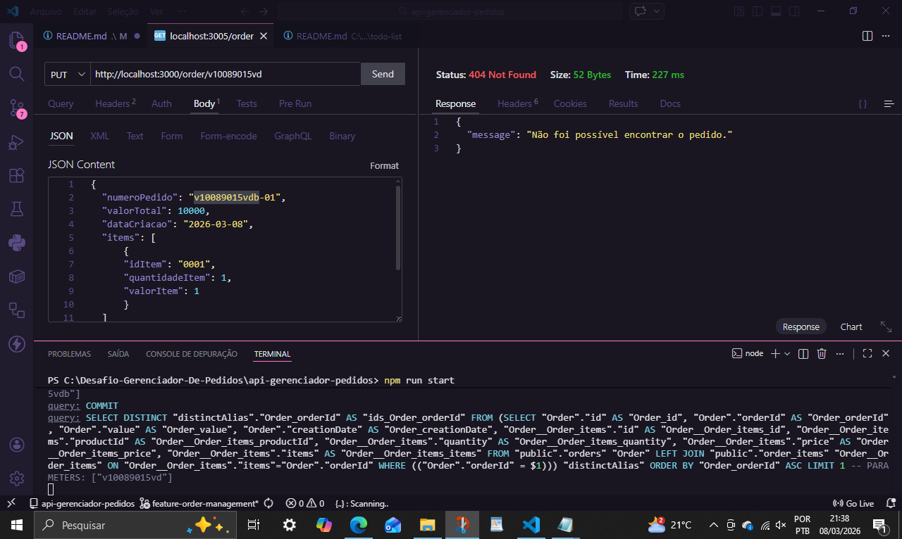
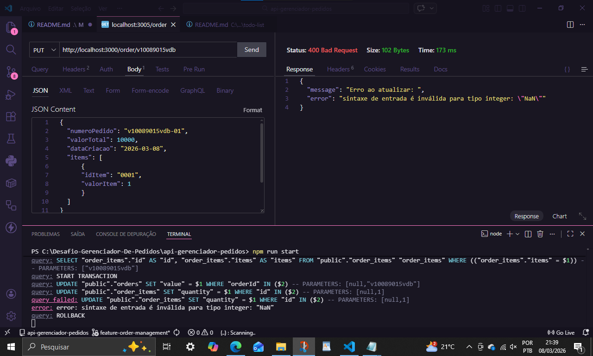
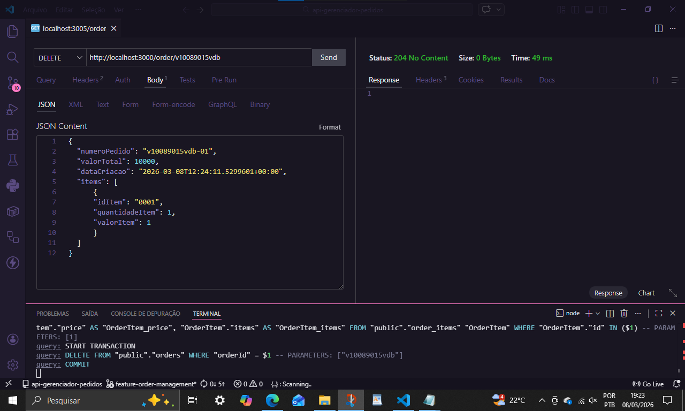
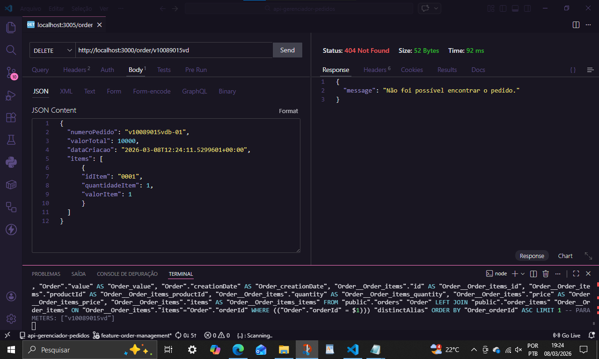

# Desafio Gerenciador de Tarefas 

## Sobre o Projeto
API RESTful desenvolvida para gerenciamento de pedidos, com operações completas de CRUD (Create, Read, Update, Delete). Construído seguindo boas práticas de desenvolvimento, com arquitetura MSC (Model-Service-Controller) e tratamento adequado de erros, de acordo com o Case Técnico.

## Principais Tecnologias Utilizadas
- Node.js - Ambiente de execução JavaScript

- JavaScript - Linguagem de programação sugerida

- Express - Framework web para Node.js

- TypeORM - ORM (Object Relational Mapper) para JavaScript

- PostgreSQL - Banco de dados relacional


## Arquitetura
O projeto segue a arquitetura MSC (Model-Service-Controller):

- Models: Responsáveis pela comunicação direta com o banco de dados via TypeORM

- Services: Contêm as regras de negócio e fazem o mapeamento dos dados

- Controllers: Gerenciam as requisições HTTP e respostas


## Estrutura do Projeto

```console
api-gerenciador-pedidos/
├── src/
│   ├── controllers/
│   │   └── orderController.js
│   ├── database/
│   │   ├── model/
│   │   │    ├── Order.js
│   │   │    └── OrderItem.js
│   │   └── dataBaseConfig.js
│   ├── routes/
│   │   └── Routes.js
│   ├── services/
│   │   └── orderService.js
│   └── server.js
├── .gitignore
├── package-lock.json
├── package.json
└── README.md
```

## Mapeamento de Dados
O serviço realiza as seguintes transformações nos dados:

Input do Cliente:

```json
{
  "numeroPedido": "v10089015vdb-01",
  "valorTotal": 10000,
  "dataCriacao": "2023-07-19T12:24:11.5299601+00:00",
  "items": [
    {
      "idItem": "2434",
      "quantidadeItem": 1,
      "valorItem": 1000
    }
  ]
}
```
Output da API:

```json
{
  "orderId": "v10089016vdb",
  "value": 10000,
  "creationDate": "2023-07-19T12:24:11.529Z",
  "items": [
    {
      "productId": 2434,
      "quantity": 1,
      "price": 1000
    }
  ]
}
```
## Transformações realizadas

numeroPedido → orderId (extração do prefixo removendo "-01" do final)

valorTotal → value (mantém o mesmo valor)

dataCriacao → creationDate (Timestamp de criação)

idItem (string) → productId (number)

quantidadeItem → quantity

valorItem → price

## Endpoints da API
### 1. Criar um novo pedido
**Obrigatório**
```markdown
URL: http://localhost:3000/order
```
Método: POST

Corpo da Requisição:

```json
{
  "numeroPedido": "v10089015vdb-01",
  "valorTotal": 10000,
  "dataCriacao": "2023-07-19T12:24:11.5299601+00:00",
  "items": [
    {
      "idItem": "2434",
      "quantidadeItem": 1,
      "valorItem": 1000
    }
  ]
}
```


### 2. Obter pedido por número
**Obrigatório**
```markdown
URL: http://localhost:3000/order/:orderId
```

Método: GET

Parâmetro: numeroPedido - Número do pedido (ex: v10089016vdb)

Status Code de Sucesso: 200 OK


Status Code de Erro: 404 Not Found (quando pedido não existe)


### 3. Listar todos os pedidos
**Opcional**

```markdown
URL: http://localhost:3000/order/list

```
Método: GET

Status Code de Sucesso: 200 OK

Resposta: Array com todos os pedidos cadastrados


### 4. Atualizar pedido
**Opcional**
```markdown
URL: http://localhost:3000/order/:numeroPedido

```
Método: PUT

Parâmetro: orderId - Número do pedido a ser atualizado

Status Code de Sucesso: 200 OK


Status Code de Erro:

404 Not Found (pedido não encontrado)



400 Bad Request (body inadequado)


### 5. Deletar pedido
**Opcional**

```markdown
URL: http://localhost:3000/order/:numeroPedido

```
Método: DELETE

Parâmetro: orderId - Número do pedido a ser deletado

Status Code de Sucesso: 204 No Content


Status Code de Erro: 404 Not Found (pedido não encontrado)


⚙️ Tratamento de Erros
A API implementa os seguintes códigos de status HTTP:

```markdown
Status Code 	Descrição	                       Quando ocorre
    201          Created 	                       Pedido criado com sucesso
    200	         OK          	                   Operações de GET, PUT e DELETE bem-sucedidas
    400          Bad Request	                   Body da requisição inválido/campos ausentes
    404	         Not Found       	               Pedido não encontrado na base de dados
    500	         Internal Server Error             Erro interno do servidor
```

## Configuração e Instalação
**Pré-requisitos**
- Node.js (v14 ou superior)

- PostgreSQL (ou Docker)

- npm ou yarn

### Passos para instalação
- Clone o repositório

```console
git clone [url-do-repositorio]
cd orders-api
```

- Instale as dependências

bash
```console
npm install
```
**ou**
```console
yarn install
```
- Configure as variáveis de ambiente
Crie um arquivo .env na raiz do projeto:


```json
.env
PORT=3000
DB_HOST=localhost
DB_PORT=5432
DB_USERNAME=seu_usuario
DB_PASSWORD=sua_senha
DB_DATABASE=orders_db
```

- Execute as migrações do banco de dados


```console
npm run typeorm migration:run
```
**ou**
```console
yarn typeorm migration:run
```
- Inicie a aplicação

```console
npm run start

```
 **ou**
```python
yarn dev

```
🧪 Exemplos de Uso
- Criando um pedido
```markdown
{
    "numeroPedido": "v10089015vdb-01",
    "valorTotal": 10000,
    "dataCriacao": "2023-07-19T12:24:11.5299601+00:00",
    "items": [
      {
        "idItem": "2434",
        "quantidadeItem": 1,
        "valorItem": 1000
      }
    ]
  }
```
- Buscando um pedido específico

```markdown
curl http://localhost:3000/order/v10089015vdb
```
- Listando todos os pedidos

```markdown
curl http://localhost:3000/order/list
```
Havendo dúvidas, siga a demonstração em Endpoints da API na sessão anterior.


## Modelo de Dados
```markdown
Entidade Order
Campo	                Tipo	                Descrição
id	                    number	                Chave primária
orderId	                string	                Número do pedido (único)
value	                number	                Valor total do pedido
creationDate	        date	                Data de criação
items	                OrderItem[]         	Itens do pedido
```

```markdown
Entidade OrderItem
Campo	            Tipo	        Descrição
id	                number	        Chave primária
productId       	number	        ID do produto
quantity	        number	        Quantidade
price	            number	        Preço unitário
orderId	            number	        FK para o pedido
```


## Validações Implementadas
-Verificação de campos obrigatórios no body

-Validação de formato do número do pedido

-Validação de valores numéricos (valorTotal, quantidadeItem, valorItem)

-Verificação de existência do pedido antes de operações de update/delete


## Melhorias Futuras
-Implementar autenticação JWT

-Adicionar paginação na listagem de pedidos

-Implementar testes unitários e de integração

-Adicionar documentação Swagger

-Implementar cache com Redis

-Adicionar validação mais robusta com class-validator


## Licença
- Este projeto está sob a licença MIT. Veja o arquivo LICENSE para mais detalhes.


